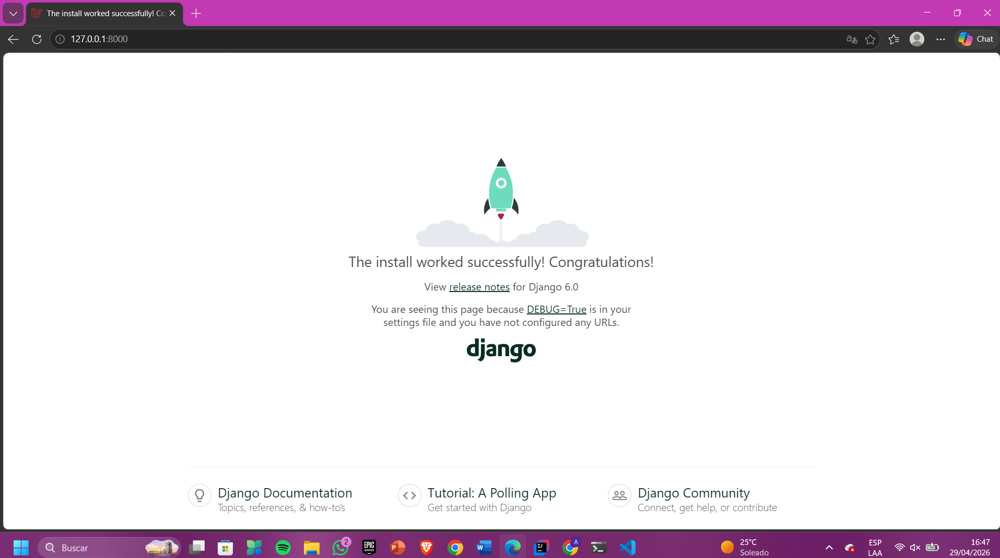
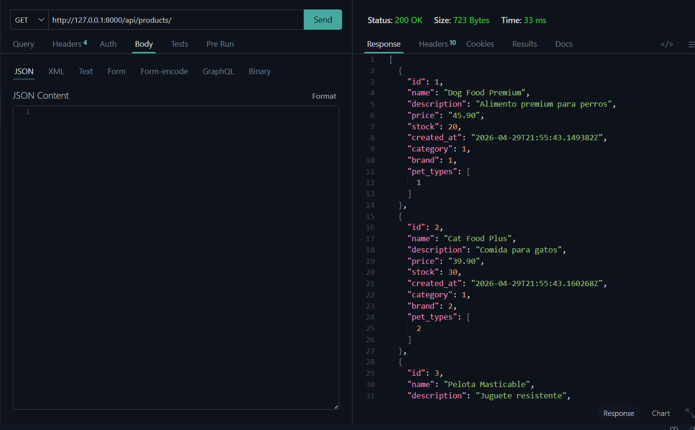
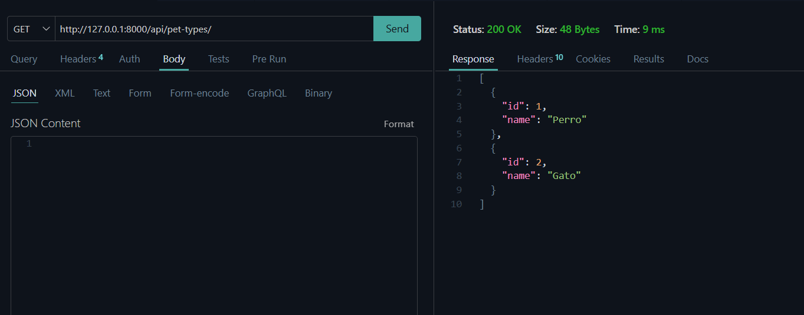
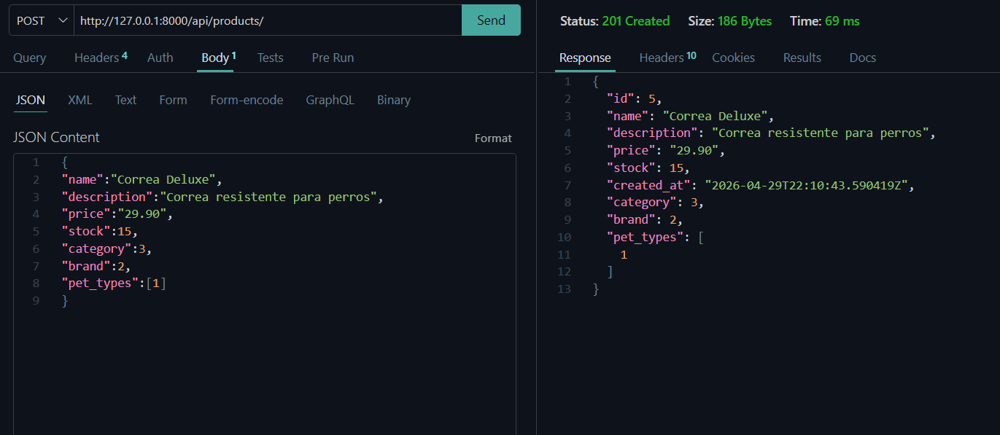
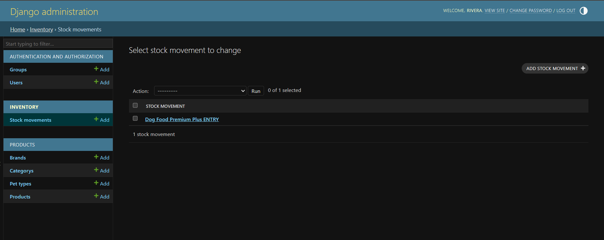
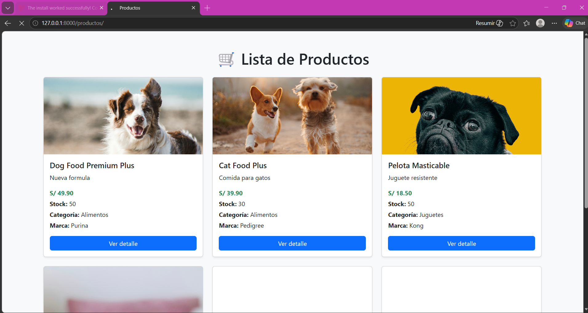

# PawAdmin 🐾

# Anderson rivera pucuhuayla

Sistema backend desarrollado con Django Rest Framework para la administración de productos para mascotas.

Proyecto orientado a practicar:

- Django
- Django REST Framework
- APIs REST
- CRUD
- Relaciones One-to-Many y Many-to-Many
- Inventario básico
- Git y GitHub

---

## Funcionalidades

### Catálogo

- Gestión de productos
- Gestión de categorías
- Gestión de marcas
- Gestión de tipos de mascota

### Inventario

- Registro de movimientos de stock
- Entradas y salidas de inventario

### API REST

Endpoints disponibles:

```http
/api/products/
/api/categories/
/api/brands/
/api/pet-types/
/api/stock-movements/
```

---

## Tecnologías

- Python
- Django
- Django REST Framework
- SQLite
- Postman

---

## Modelo de datos

Entidades principales:

- Product
- Category
- Brand
- PetType
- StockMovement

Relaciones:

- Category 1:N Product
- Brand 1:N Product
- Product N:M PetType

---

## Instalación

Clonar repositorio:

https://github.com/Ingaxgaramendi/pawadmin.git

Crear entorno virtual:

```bash
python -m venv venv
```

Activar:

Windows

```bash
venv\Scripts\activate
```

Instalar dependencias:

```bash
pip install -r requirements.txt
```

Migraciones:

```bash
python manage.py migrate
```

Ejecutar servidor:

```bash
python manage.py runserver
```

---

## Pruebas API

### Productos

- GET products

- POST product
- PATCH update stock
- DELETE product

### Categories

- CRUD completo probado

### Pet Types

- CRUD completo probado

### Inventory

- Registro de entradas y salidas probado

---

## Capturas

### Corriendo proyecto



---

### GET products



---

### GET Pet-types



---

### Relacion muchos a muchos - pet-types --- productos



---

### Nueva App Inventory


!

## 

## Ejemplo JSON

```json
{
  "id": 1,
  "name": "Dog Food Premium",
  "price": "45.90",
  "stock": 20,
  "category": 1,
  "brand": 1,
  "pet_types": [1]
}
```

---

## Autor

Anderson Rivera
